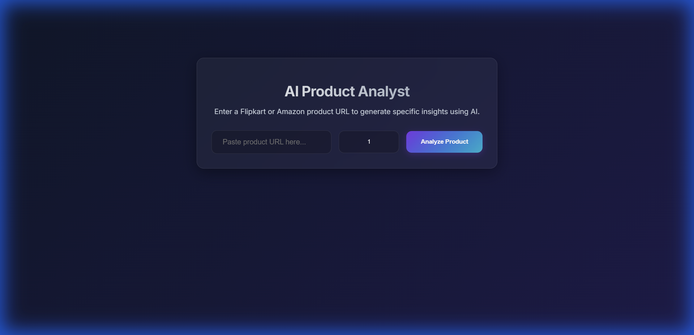
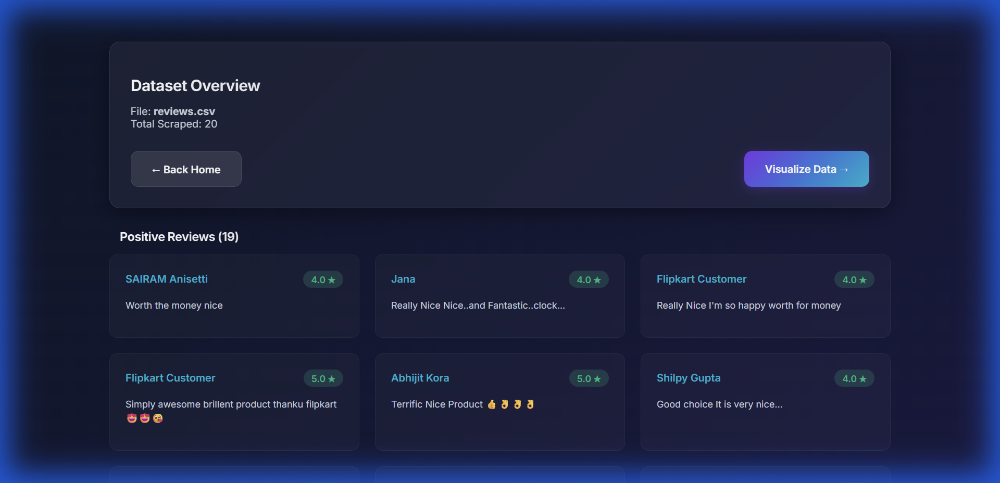
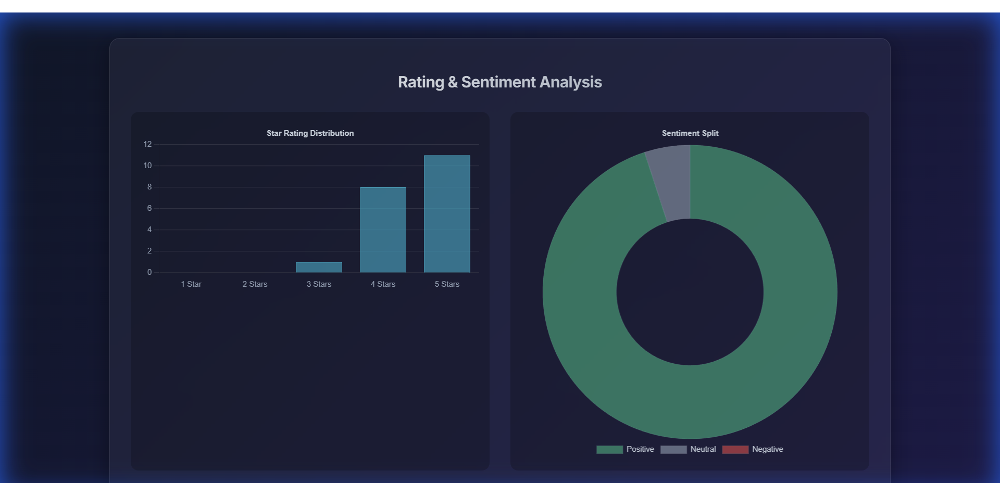

# Sentiment Analysis for Business Insights 🚀

An advanced AI-powered product analyst tool that scrapes reviews from Flipkart/Amazon, performs sentiment analysis, and generates actionable business insights using Google Gemini AI.



## 🌟 Key Features

- **Robust Web Scraper**: improved logic to handle dynamic content, "Certified Buyer" verification, and automatic pagination.
- **AI-Powered Analysis**: Uses Google Gemini 2.5 Flash to generate executive summaries, pros/cons, and improvement recommendations.
- **Interactive Visualizations**: Beautiful Chart.js dashboards showing Rating Distribution and Sentiment Split.
- **Premium Glassmorphism UI**: A modern, dark-themed interface with neon accents and frosted glass effects.
- **Multi-Page Scraping**: Scrape multiple pages of reviews at once for a balanced dataset (Most Helpful sorting).

## 🛠️ Setup & Installation

1.  **Clone the Repository**
    ```bash
    git clone https://github.com/Cloudbed-invi/Sentiment-analysis-for-business-insights.git
    cd Sentiment-analysis-for-business-insights
    ```

2.  **Install Dependencies**
    ```bash
    pip install -r requirements.txt
    ```

3.  **Configure API Key**
    - Create a `.env` file in the root directory.
    - Add your Gemini API key:
      ```env
      GEMINI_API_KEY=your_api_key_here
      ```

## 📋 Prerequisites

Before running, ensure you have:
*   **Google Chrome** installed (required for the scraper).
*   **Python 3.8+** installed.
*   **Git** installed.

4.  **Run the Application**
    ```bash
    python app.py
    ```
    Open your browser at `http://127.0.0.1:5000`.

## 📸 Screenshots

### 1. Results Grid
Clean, card-based layout displaying reviews with sentiment badges.


### 2. Interactive Charts
Visualize customer sentiment and rating trends.


### 3. AI Intelligence
Get deep insights into what customers love and hate.


## 📂 Project Structure

```
.
├── app.py              # Main Flask application (Backend & AI Logic)
├── scraper.py          # Robust Selenium scraper for Flipkart/Amazon
├── templates/          # HTML templates (Glassmorphism UI)
├── static/             # CSS styles, images, and plots
├── requirements.txt    # Python dependencies
├── .env                # API keys (Not tracked in Git)
├── README.md           # Project documentation
└── archive/            # Old scripts and debugging tools
```

